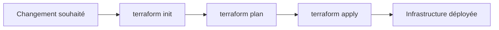

# Jour 1 – Introduction à Terraform

> **Challenge 30 jours pour apprendre Terraform en français**

Bienvenue dans le **Jour 1** de notre challenge ! Aujourd'hui, nous posons les bases et explorons les concepts fondamentaux de Terraform et de l'Infrastructure as Code (IaC).

---

## 📋 Objectifs du jour

- [x] Comprendre ce qu'est Terraform et pourquoi il est utilisé
- [x] Découvrir le langage **HCL** (HashiCorp Configuration Language)
- [x] Comprendre les concepts de **provider**, **state**, **backend**, et **workspaces**
- [x] Se familiariser avec le workflow Terraform : `init` → `plan` → `apply`

---

## Pourquoi Terraform ?

Créer et gérer des infrastructures cloud à la main peut être **complexe** et **chronophage**.

### Exemple concret
Par exemple, j'ai dû créer un VPC sur AWS entièrement à la main, et même avec de l'expérience, cela m'a pris des heures pour configurer correctement toutes les ressources et suivre les bonnes pratiques.

### La révélation Terraform
- **Infrastructure as Code** : Terraform permet de décrire l'infrastructure avec du code
- **Automatisation** : Le moteur Terraform se charge de créer, modifier ou supprimer automatiquement les ressources
- **Gain de temps** : Une tâche qui prenait des heures peut maintenant être réalisée en quelques minutes

---

##  Comprendre l'IaC et Terraform

L'**Infrastructure as Code (IaC)** est une approche permettant de provisionner des infrastructures à l'aide de pratiques de codage.

###  Points clés

| Aspect | Description |
|--------|-------------|
| **Alternatives** | Pulumi, AWS CloudFormation, GCP Deployment Manager |
| **Avantages Terraform** | Multi-cloud et déclaratif → plus simple et flexible |
| **Intégration** | Versioning Git, analyse qualité/sécurité, pipelines CI/CD |

---

## 🧩 Concepts fondamentaux de Terraform

###  HCL (HashiCorp Configuration Language)
Un langage déclaratif et lisible, proche de l'anglais, permettant de définir l'état final souhaité de l'infrastructure.

###  Provider (Fournisseur)
Plugin qui permet à Terraform de communiquer avec des services externes comme AWS, Azure, Google Cloud, Docker ou GitHub.

###  State (État)
Fichier `terraform.tfstate` qui stocke la photographie actuelle de l'infrastructure.

###  Backend
Emplacement où l'état est stocké, local ou distant (ex : AWS S3, Azure Blob Storage).

###  Workspaces
Permettent de gérer plusieurs environnements (dev, test, prod) avec des états séparés.

---

##  Le workflow Terraform en pratique

Le cycle de déploiement Terraform suit toujours ces étapes :

### 📋 Détail des étapes

1. **Changement souhaité** : ajouter, modifier ou supprimer une ressource
2. **`terraform init`** : initialise le projet, télécharge les providers et configure le backend
3. **`terraform plan`** : compare l'état actuel avec le code et génère un plan d'action
4. **`terraform apply`** : applique le plan en créant, modifiant ou supprimant les ressources

> **💡 Note** : Ce flux garantit que l'infrastructure correspond exactement à ce qui est défini dans le code.

---

##  Prochaines étapes

Dans le **Jour 2**, nous entrerons dans la pratique en :
- Créant notre premier fichier Terraform
- Configurant un provider AWS
- Déployant notre première ressource

---

##  Ressources et bibliographie

###  Documentation officielle
- [Documentation Terraform – AWS Provider](https://registry.terraform.io/providers/hashicorp/aws/latest/docs)

### 📚 Livres recommandés
- **Brikman, Y.** (2023). *Terraform: Up and Running, 3rd Edition*. O'Reilly Media.
- **McKendrick, R.** (2021). *Infrastructure as Code for Beginners*. Packt Publishing.

---

**[⬅️ Accueil](../README.md) | [Jour 2 ➡️](../jour2/README.md)**

*Challenge 30 jours Terraform - Jour 1/30*

